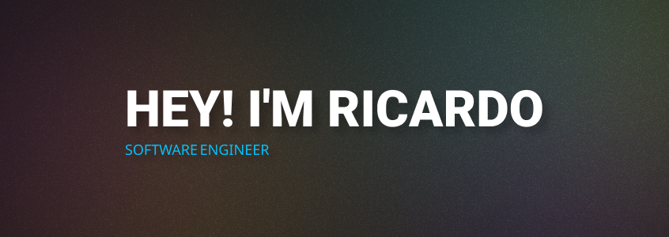

  

###

  

###

<h3 align="left">👩‍💻  About Me</h3>

###

I'm Ricardo Domingues, from Aveiro, Portugal.  - 🔭 I’m working as a Senior Software Engineer at Siteimprove's Integrations team; - 📚 I'm currently learning Go, IaC and K8s. Also playing around a bit with file streaming and other backend stuff; - ⚡ In my free time I watch tv series and videos, code and workout.

###

<h3 align="left">🛠 Languages and tools</h3>

###

  
  
  
  
  
  
  
  
  
  
  
  
  
  
  
  
  
  
  
  
  
  
  
  
  
  
  
  
  
  
  
  
  
  
  

###

<h3 align="left">🔥   My Stats :</h3>

###

  
  
  
  

###
